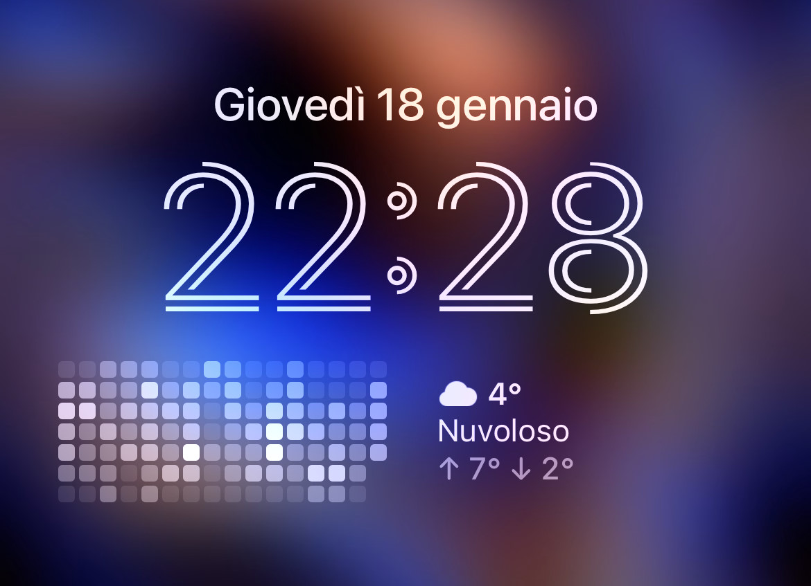

# My Scriptable collection

This repository is a curated collection of Scriptable widgets that I have created. 

## Widgets

### GitHub Contributions

This widget displays your GitHub contributions graph on the lockscreen, allowing you to quickly see your contribution levels over the past weeks. It fetches data directly from GitHub's GraphQL API.

#### Features

- Shows a heatmap similar to the one on your GitHub profile
- Customizable username through widget parameter
- Cached data for faster load times and reduced API calls

## Getting Started

### Download with ScriptDude

### Manual Installation

#### Prerequisites

Before you can use these widgets, you need to:

- Install the [Scriptable app](https://apps.apple.com/us/app/scriptable/id1405459188) from the iOS App Store.
- Have your GitHub Personal Access Token ready for widgets that require GitHub data.

#### Installation

To install a widget on your iOS device:

1. Download the `.js` file for the widget you want to use.
2. Open the Scriptable app and tap the "+" icon to create a new script.
3. Give your script a name and paste the contents of the `.js` file into the editor.
4. Configure any necessary parameters or settings within the script.
5. Close the Scriptable app and add the Scriptable widget to your home screen.
6. Long press the widget, choose "Edit Widget", and select the script you added.
